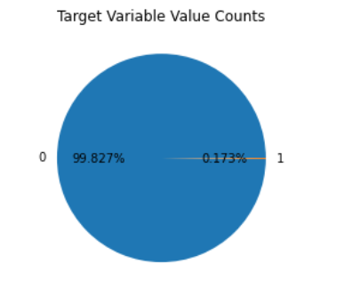
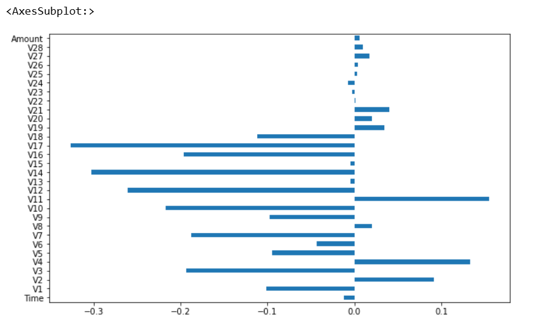
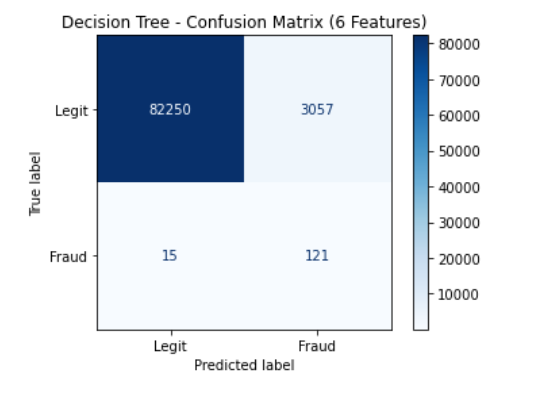
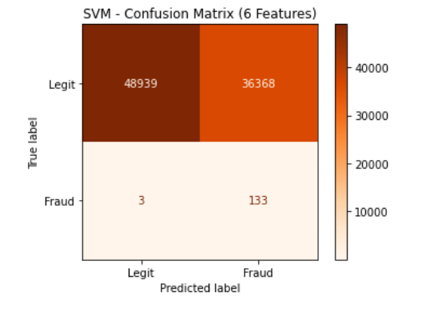
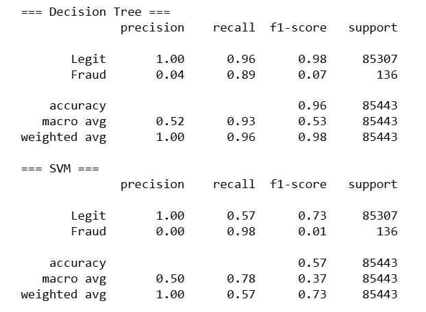
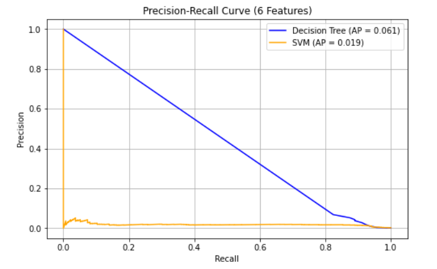
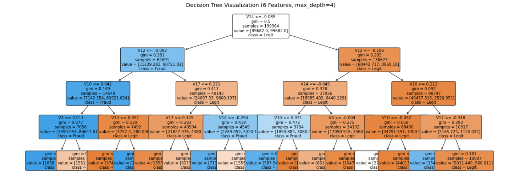
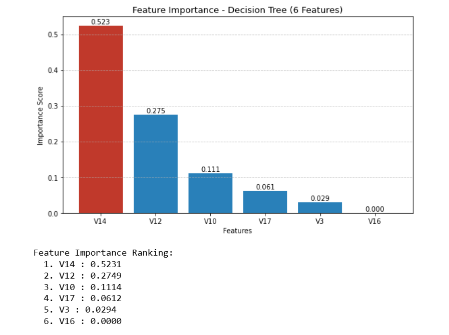

# Credit Card Fraud Detection

A machine learning project that builds and evaluates binary classification models 
to identify fraudulent credit card transactions from a real-world highly imbalanced dataset.

## Dataset
- Source: [Kaggle - Credit Card Fraud Detection](https://www.kaggle.com/mlg-ulb/creditcardfraud)
- 284,807 transactions | Only 492 fraudulent (0.172%)
- Features V1–V28 are PCA-transformed for confidentiality

## Visualization
<!--  -->
 
 
 
 

## Models Used
- Decision Tree Classifier (scikit-learn)
- Support Vector Machine — LinearSVC (scikit-learn)

## What's Covered
- Data preprocessing: StandardScaler + L1 Normalization
- Class imbalance handling via sample weights
- Training on all 29 features vs top 6 correlated features
- Evaluation: ROC-AUC, Confusion Matrix, Precision-Recall, F1-Score
- Decision Tree visualization (full depth + top 3 levels)
- Feature importance analysis

## Key Results

| Model | All 29 Features (ROC-AUC) | Top 6 Features (ROC-AUC) |
|---|---|---|
| Decision Tree | 0.939 | 0.952 |
| SVM | 0.986 | 0.937 |

## Feature Importance (Top 6)
| Rank | Feature | Importance |
|---|---|---|
| 1 | V14 | 0.5231 |
| 2 | V12 | 0.2749 |
| 3 | V10 | 0.1114 |
| 4 | V17 | 0.0612 |
| 5 | V3 | 0.0294 |
| 6 | V16 | 0.0000 |

## Key Findings
- V14 alone drives over 52% of the Decision Tree's fraud detection decisions
- Decision Tree improved with feature reduction (0.939 → 0.952) due to noise removal
- SVM performs better with high-dimensional data (dropped from 0.986 → 0.937 with 6 features)
- Decision Tree is the more practical model — better precision-recall balance for real banking use

## Requirements
pandas
numpy
scikit-learn
matplotlib

## How to Run
1. Download `creditcard.csv` from Kaggle and place it in the project root
2. Open `Credit_Card_Fraud_Detection.ipynb` in Jupyter Notebook
3. Run all cells sequentially

## Author
Shahid Abbas — Machine Learning Engineer
